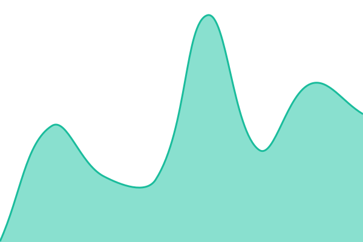
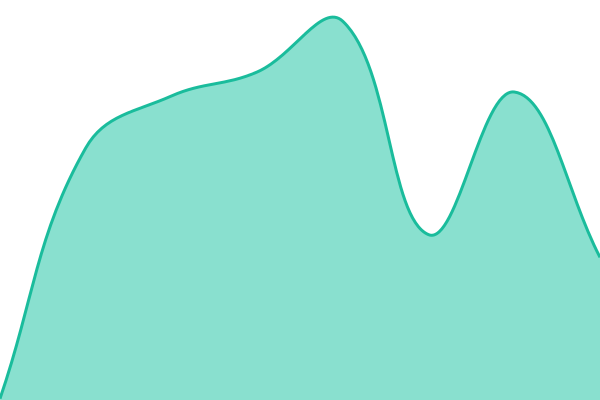
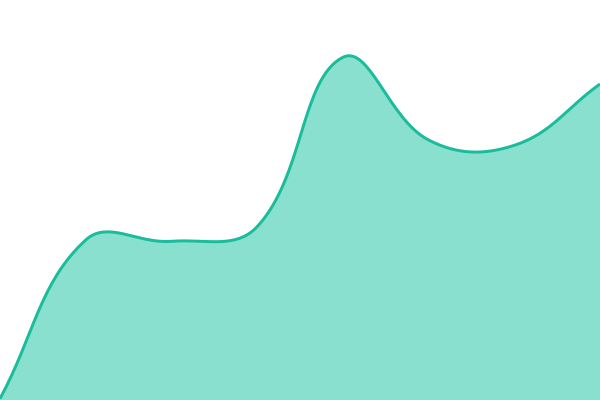

# [📈 Live Status](https://status.carmesiservices.com): <!--live status--> **🟩 All systems operational**

This repository contains the open-source uptime monitor and status page for [Carmesí Services](https://carmesiservices.com), powered by [Upptime](https://github.com/upptime/upptime).

With [Upptime](https://upptime.js.org), you can get your own unlimited and free uptime monitor and status page, powered entirely by a GitHub repository. We use [Issues](https://github.com/CarmesiServices/status/issues) as incident reports, [Actions](https://github.com/CarmesiServices/status/actions) as uptime monitors, and [Pages](https://status.carmesiservices.com) for the status page.

<!--start: status pages-->
<!-- This summary is generated by Upptime (https://github.com/upptime/upptime) -->
<!-- Do not edit this manually, your changes will be overwritten -->
<!-- prettier-ignore -->
| URL | Status | History | Response Time | Uptime |
| --- | ------ | ------- | ------------- | ------ |
|  [Carmesí Services](https://carmesiservices.com) | 🟩 Up | [carmesi-services.yml](https://github.com/CarmesiServices/status/commits/HEAD/history/carmesi-services.yml) | 

 149ms
     
 | 

<a href="https://status.carmesiservices.com/history/carmesi-services">100.00%</a>
    

|  [Automatización (n8n)](https://n8n.agendyfix.com/healthz) | 🟩 Up | [automatizacion-n8n.yml](https://github.com/CarmesiServices/status/commits/HEAD/history/automatizacion-n8n.yml) | 

 263ms
     
 | 

<a href="https://status.carmesiservices.com/history/automatizacion-n8n">100.00%</a>
    

|  [Agendyfix API](https://us-api.agendyfix.com) | 🟩 Up | [agendyfix-api.yml](https://github.com/CarmesiServices/status/commits/HEAD/history/agendyfix-api.yml) | 

 620ms
     
 | 

<a href="https://status.carmesiservices.com/history/agendyfix-api">100.00%</a>
    

|  [Agendyfix App](https://app.agendyfix.com) | 🟩 Up | [agendyfix-app.yml](https://github.com/CarmesiServices/status/commits/HEAD/history/agendyfix-app.yml) | 

 1031ms
     
 | 

<a href="https://status.carmesiservices.com/history/agendyfix-app">100.00%</a>
    

|  [Data (Metabase)](https://us-data.agendyfix.com/api/health) | 🟩 Up | [data-metabase.yml](https://github.com/CarmesiServices/status/commits/HEAD/history/data-metabase.yml) | 

 215ms
     
 | 

<a href="https://status.carmesiservices.com/history/data-metabase">100.00%</a>
    

<!--end: status pages-->

[**Visit our status website →**](https://status.carmesiservices.com)

## 📄 License

- Powered by: [Upptime](https://github.com/upptime/upptime)
- Code: [MIT](./LICENSE) © [Carmesí Services](https://carmesiservices.com)
- Data in the `./history` directory: [Open Database License](https://opendatacommons.org/licenses/odbl/1-0/)
